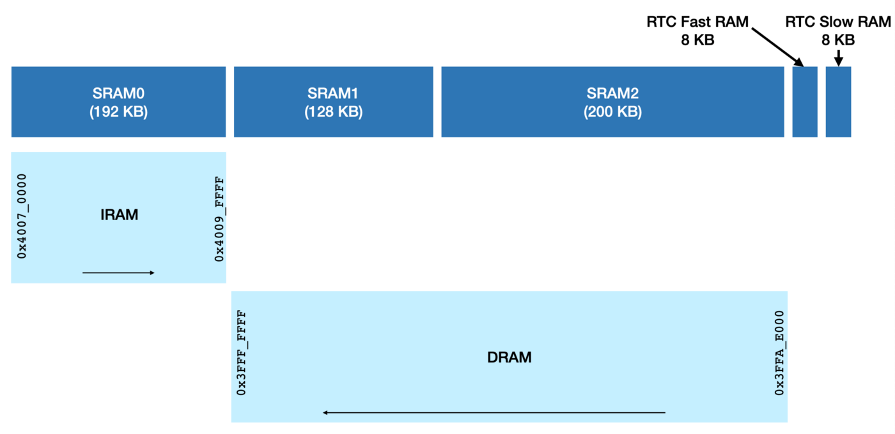

# Envi Sensor

## Device Description

The Envi Sensor is digital thermometer and hygrometer powered by the [ESP32 board](https://www.espressif.com/en/products/socs/esp32).

Temperature and humidity are collected every 30 seconds and displayed on the Nokia 5110 display.

With the help of the onboard button, the user can choose among three different views:

1. `DEFAULT VIEW`: show current temperature and humidity

2. `TEMPERATURE ANALYSIS`: show min, median, and max temperature among the last 240 readings (last 2 hours)

3. `HUMIDITY ANALYSIS`: show min, median, and max humidity among the last 240 readings (last 2 hours)

Both the reading frequency (default: every 30 sec) and the number of readings stored (default: 240) can be adjusted upon compilation using the [KConfig TUI](https://docs.espressif.com/projects/esp-idf/en/latest/esp32/api-reference/kconfig.html) provided with the ESP-IDF installation (see below).

TODO LORIS: update link iOS

Last but not least, the Envi Sensor acts as a [Bluetooth Low Energy](https://learn.adafruit.com/introduction-to-bluetooth-low-energy) (BLE) GATT Server, from which a smartphone (or any BLE-enabled device) can read the last temperature and humidity.  
This [example iOS application](github.com/dehre/ios-envi-sensor), acting as a GATT Client, connects to the Envi Sensor and requests new data every 5 seconds.

TODO LORIS: upload picture

TODO LORIS: upload link to youtube video, stating that reading frequency has been decreased to 500ms

## README Sections

- [Device Description](#device-description)

- [Bill of Materials](#bill-of-materials)

- [Building and Flashing](#building-and-flashing)

- [Tests](#tests)

- [Configuring the Envi Sensor](#configuring-the-envi-sensor)

- [Tasks Overview](#tasks-overview)

- [Tasks Stack Size](#tasks-stack-size)

- [Hardware Connection](#hardware-connection)

- [Push Button Debouncing](#push-button-debouncing)

- [External Components](#external-components)

- [ssd1306 Library Workaround](#ssd1306-library-workaround)

- [BLE Setup](#ble-setup)

- [BLE Events Lifecycle](#ble-events-lifecycle)

- [Memory Usage](#memory-usage)

- [Power Consumption](#power-consumption)

## Bill of Materials

- [ESP32-DevKitC V4](https://docs.espressif.com/projects/esp-idf/en/latest/esp32/hw-reference/esp32/get-started-devkitc.html)

  - with [ESP32-WROOM-32 module](https://www.mouser.com/datasheet/2/891/esp-wroom-32_datasheet_en-1223836.pdf) in my case, which features two 32-bit CPU cores, 4MB Flash, 520KB SRAM, Wi-Fi, Bluetooth LE, and a whole bunch of peripherals

- [SHT21](https://eu.mouser.com/ProductDetail/Sensirion/SHT21?qs=wWC4CIiyLaNbiIJO6bf9AA%3D%3D) temperature and humidity sensor (GY-21 module in my case), communicating over I2C

- [Nokia 5110 display](https://eu.mouser.com/ProductDetail/Adafruit/338?qs=GURawfaeGuDJpcPmpvWgCw%3D%3D), communicating over SPI

- normally-open push button, set up in negative logic using the ESP32's internal pull-up resistor

- [ESP-Prog JTAG Adapter](https://docs.espressif.com/projects/espressif-esp-iot-solution/en/latest/hw-reference/ESP-Prog_guide.html) (optional, useful for development)

- [logic analyzer](https://www.sparkfun.com/products/18627) (optional, useful for development)

- breadboard and cables as usual

## Building and Flashing

Assuming you have [ESP-IDF setup on your machine](https://docs.espressif.com/projects/esp-idf/en/latest/esp32/get-started/index.html), the following commands build and flash the application on the board:

```sh
get_idf # if not done already
idf.py build
idf.py -p <port> flash monitor
```

## Tests

Tests have been written for these 2 modules:

- `store_float_into_uint8_arr`

- `ringbuf`

The first converts a floating-point number to a 16-bit integer with resolution of 0.01, and is needed to comply with the BLE GATT specification for temperature and humidity (more details below).  
The second is a ring-buffer implementation for floating-point numbers, and is needed for storing the most recent 240 temperature and humidity readings.

Both modules are fairly isolated, and could be tested quite easily.  
Tests have been written using [Unity test framework](https://github.com/ThrowTheSwitch/Unity), supported by ESP-IDF out of the box.  
To run the tests, `cd` into the `test` directory first, then build and flash as usual:

```sh
get_idf # if not done already
cd test
idf.py build
idf.py -p <port> flash monitor
```

## Configuring the Envi Sensor

By default, the Envi Sensor is going to collect sensor readings every 30 seconds, and store 240 of them.  
Doing some very difficult math, readings will be stored for `30 seconds * 240 readings / 60 seconds = 120 minutes`.

These values (`READ_SENSOR_FREQUENCY_MS` and `LCD_RINGBUF_DATA_LEN`) can be adjusted by the user upon compilation, using the [KConfig TUI](https://docs.espressif.com/projects/esp-idf/en/latest/esp32/api-reference/kconfig.html) (or through the Eclipse plugin / VSCode extension).  
The menu is located under `Component config ---> Envi Sensor`:

```sh
idf.py menuconfig # will open a terminal-based project configuration menu
idf.py build
```

TODO LORIS: upload pic

## Tasks Overview

To understand how the different parts of the application work with each other, it's useful to know what each [FreeRTOS](https://www.freertos.org/index.html) Task is responsible for:

- `task_read_sensor`: periodically reads temperature and humidity from the SHT21 sensor and writes them to the binary queues `binqueue_ble` and `binqueue_lcd`

- `task_update_ble`: waits for `binqueue_ble` to hold new data, gets it, and updates the temperature/humidity BLE GATT characteristics

- `task_update_lcd_ring_buffer`: waits for `binqueue_ble` to hold new data, gets it, writes it to the ring-buffers `ringbuf_lcd_temperature` and `ringbuf_lcd_humidity`, and signals `binsemaphore_lcd_render`

- `button_isr_handler`: waits from a falling edge, debounces the button, select the next view to be displayed, and signals the binary semaphore `binsemaphore_lcd_render`; this is actually an interrupt handler, not a task

- `task_render_lcd_view`: waits for `binsemaphore_lcd_render`, and re-renders the appropriate view on the lcd

In addition:

- the module `ble` takes care of setting up the BLE server and updating the temperature and humidity GATT characteristics

- the module `lcd` takes care of rendering appropriate view on the Nokia 5110 display

- the module `button` takes care of initializing the GPIO peripheral for the lcd-button (with internal pull-up resistor and interrupt on falling edges) and debouncing it when needed

## Tasks Stack Size

Each FreeRTOS task requires RAM that is used to hold the task state, and used by the task as its stack.  
If a task is created using [xTaskCreate](https://www.freertos.org/a00125.html), then the required RAM is automatically allocated from the FreeRTOS heap.

As recommended by [the FreeRTOS FAQ](https://www.freertos.org/FAQMem.html#StackSize), tasks' stack size has been tuned taking a pragmatic trial and error approach using the [uxTaskGetStackHighWaterMark](https://www.freertos.org/uxTaskGetStackHighWaterMark.html) API function.  
With each task being given 2048 words, these are the registered high water marks in words:

```
task_read_sensor:            404 words (1616 bytes)
task_update_ble:             420 words (1680 bytes)
task_update_lcd_ring_buffer: 436 words (1744 bytes)
task_render_lcd_view:        460 words (1840 bytes)
```

## Hardware Connection

The connection between ESP Board and the other components is as follows:

```
   ________________                        ________________
  |                |                      |                |
  |              32|______________________|SDA             |
  |              33|______________________|SCL             |
  |             3V3|______________________|VIN             |
  |             GND|______________________|GND             |
  |                |                      |                |
  |                |                      |__SHT21_Sensor__|
  |                |
  |                |                       ________________
  |                |                      |                |
  |              16|______________________|RST             |
  |               5|______________________|CE              |
  |              17|______________________|DC              |
  |              23|______________________|DIN             |
  |              18|______________________|CLK             |
  |             3V3|______________________|VCC             |
  |                |                      |LIGHT           |
  |             GND|______________________|GND             |
  |                |                      |                |
  |                |                      |_Nokia_5110_LCD_|
  |                |
  |                |                       ________________
  |                |                      |                |
  |              21|______________________|A               |
  |             GND|______________________|B    __/__      |
  |                |                      |                |
  |                |                      |__Push_Button___|
  |                |

-----------------Optional___Debugging_Tools-------------------

  |                |                       ________________
  |                |                      |                |
  |              15|______________________|TDO             |
  |              12|______________________|TDI             |
  |              13|______________________|TCK             |
  |              14|______________________|TMS             |
  |             GND|______________________|GND             |
  |                |                      |                |
  |                |                      |__JTAG_Adapter__|
  |                |
  |                |                       ________________
  |                |                      |                |
  |              25|______________________|CH1             |
  |             GND|______________________|GND             |
  |                |                      |                |
  |_____ESP32______|                      |_Logic_Analyzer_|
```

The JTAG adapter and logic analyzer can of course be removed after development.

## Push Button Debouncing

Many inexpensive buttons will mechanically oscillate for up to tens of milliseconds when touched or released.  
This can cause the GPIO peripheral to trigger multiple interrupts, and the application to behave as the user pressed the button multiple times, when, in fact, he/she did it only once.

The next few lines will try to concisely explain the approach took for debouncing the button:

- the `button_init` function, after setting up the GPIO pin, creates a new FreeRTOS Task named `task_debounce_button`

- when the button is touched, the interrupt handler is called, interrupts are disabled, and the binary semaphore `binsemaphore_button_debounce` is signaled

- the task `task_debounce_button`, which was idle waiting for the semaphore, wakes up, waits x milliseconds, and finally re-enables the interrupts on the button

This approach allows a single function call, made in the ISR handler, to acknowledge and debounce the button without 1. adding delays to the application, and 2. requiring a second function call to re-enable interrupts.

```c
// main.c
static void button_isr_handler(void *param)
{
    button_debounce();
    // do whatever else needs to be done
}
```

## External Components

- [sht21](https://github.com/dehre/sht21) - driver for the SHT21 temperature and humidity sensor (I'm the author)

- [ssd1306](https://github.com/lexus2k/ssd1306) - driver for the Nokia 5110 display

## ssd1306 Library Workaround

The `ssd1306` library cannot render non-ASCII characters, so it displays an empty space each time it encounters one, such as `°`:

```c
ssd1306_printFixed(0,  8, "100°C", STYLE_NORMAL);
```

To work around this limitation, the `lcd` module `memcpy` the existing ASCII font in a static variable, and replaces the bitmap for the `'` character (which isn't needed anyway) with the bitmap for the `°` character.  
As consequence, each time the `'` is used, the `°` character is displayed.

More info at this link: https://github.com/lexus2k/ssd1306/issues/139#issuecomment-1106239972

## BLE Setup

The SHT21 sensor readings are advertised over BLE as a [GATT Environmental Sensing Service](https://www.bluetooth.com/specifications/specs/) (GATT Assigned Number `0x181A`).  
The service has two Characteristics, one representing temperature (`0x2A6E`) and one representing Humidity (`0x2A6F`).

[Each GATT Characteristic defines how the data should be represented](https://www.bluetooth.com/specifications/specs/gatt-specification-supplement-5/):

- _Temperature_

From the GATT Specification Supplement Datasheet Page 223 Section 3.204:

> The data type is a 16-bit signed integer.  
> Unit is degrees Celsius with a resolution of 0.01 degrees Celsius.  
> Allowed range is: -273.15 to 327.67.  
> A value of 0x8000 represents 'value is not known'.  
> All other values are prohibited.

- _Humidity_

From the GATT Specification Supplement Datasheet Page 223 Section 3.204:

> The data type is a 16-bit unsigned integer.  
> Unit is in percent with a resolution of 0.01 percent.  
> Allowed range is: 0.00 to 100.00.  
> A value of 0xFFFF represents 'value is not known'.  
> All other values are prohibited.

Using the `sht21` library, both temperature and humidity are retrieved as floating point numbers.  
The Temperature GATT Characteristic, however, requires a signed 16-bit value, so the captured value (e.g. 9.87°C) is multiplied by 100, then converted to an integer (e.g. 987).  
Similar reasoning goes for the Humidity GATT Characteristic.

For a nice overview of BLE and GATT, check out [this article from Adafruit](https://learn.adafruit.com/introduction-to-bluetooth-low-energy/gatt).

## BLE Events Lifecycle

This log shows the order in which BLE events are triggered when a BLE-client (i.e. smartphone) connects to the ESP32.  
It can be useful for debugging:

```sh
#
# Booting application
#

W (937) gatts_event_handler: ESP_GATTS_REG_EVT
W (947) gatts_profile_event_handler: ESP_GATTS_REG_EVT
W (947) gatts_profile_event_handler: ESP_GATTS_CREAT_ATTR_TAB_EVT:
W (957) gap_event_handler: ESP_GAP_BLE_ADV_DATA_SET_COMPLETE_EVT
W (967) gatts_profile_event_handler: ESP_GATTS_START_EVT
W (977) gap_event_handler: ESP_GAP_BLE_ADV_START_COMPLETE_EVT

#
# Connecting to the Envi Sensor from a BLE client
#

W (17257) gatts_profile_event_handler: ESP_GATTS_CONNECT_EVT
W (17347) gatts_profile_event_handler: ESP_GATTS_MTU_EVT
W (17677) gap_event_handler: ESP_GAP_BLE_UPDATE_CONN_PARAMS_EVT

#
# Reading the temperature characteristic 3 times
#

W (20197) gatts_profile_event_handler: ESP_GATTS_READ_EVT
W (22717) gatts_profile_event_handler: ESP_GATTS_READ_EVT
W (23587) gatts_profile_event_handler: ESP_GATTS_READ_EVT

#
# Disconnecting the BLE client from the Envi Sensor
#

W (27577) gatts_profile_event_handler: ESP_GATTS_DISCONNECT_EVT
W (27597) gap_event_handler: ESP_GAP_BLE_ADV_START_COMPLETE_EVT
```

## Memory Usage

ESP32's internal memory (SRAM) is divided into 3 memory blocks: SRAM0, SRAM1 and SRAM2.

The SRAM is used in two ways:

- instruction memory, IRAM, (used for code execution — text data), and

- data memory, DRAM, used for BSS, data, heap.

SRAM0 is used as IRAM.  
SRAM1 and SRAM2 are used as DRAM.



The memory information about the Envi Sensor can be retrieved via the command `idf.py size`:

```
Total sizes:
Used static DRAM:   39644 bytes (  84936 remain, 31.8% used)
      .data size:   18516 bytes
      .bss  size:   21128 bytes
Used static IRAM:  104219 bytes (  26853 remain, 79.5% used)
      .text size:  103192 bytes
   .vectors size:    1027 bytes
Used stat D/IRAM:  143863 bytes ( 111789 remain, 56.3% used)
      .data size:   18516 bytes
      .bss  size:   21128 bytes
      .text size:  103192 bytes
   .vectors size:    1027 bytes
Used Flash size :  503631 bytes
      .text     :  396451 bytes
      .rodata   :  106924 bytes
Total image size:  749101 bytes (.bin may be padded larger)
```

Although technically SRAM1 could be used both as IRAM and DRAM, for practical purposes ESP-IDF uses SRAM1 as DRAM.  
Nonetheless, it's still shown as D/IRAM in the snippet above.

For more information, here's [a very nice article about ESP32's memory layout](https://blog.espressif.com/esp32-programmers-memory-model-259444d89387).

## Power Consumption

The ESP32-DevKitC V4 can be powered in [one of these three ways](https://docs.espressif.com/projects/esp-idf/en/latest/esp32/hw-reference/esp32/get-started-devkitc.html#power-supply-options):

1. micro-USB port - also used for flashing and monitoring the application

2. unregulated power source - [through the onboard AMS1117-3.3 voltage regulator](https://dl.espressif.com/dl/schematics/esp32_devkitc_v4-sch.pdf), anything between 4.8V and 12V [should work](https://datasheet.lcsc.com/szlcsc/2001081204_Shikues-AMS1117-1-2_C475600.pdf)

3. regulated 3.3V - bypassing the voltage regulator

As stated in the official docs:

> The power supply must be provided using one and only one of the options above, otherwise the board and/or the power supply source can be damaged.

Being a BLE GATT server, the Envi Sensor is a quite power-hungry device.  
Power saving modes are unfortunately not an option, as [in both Deep-sleep and Light-sleep the wireless peripherals are powered down](https://docs.espressif.com/projects/esp-idf/en/latest/esp32/api-reference/system/sleep_modes.html#wi-fi-bluetooth-and-sleep-modes).

The biggest cut in current consumption has been achieved by reducing the BLE advertising frequency to 1285ms.  
Apple [imposes some limitations](https://developer.apple.com/library/archive/qa/qa1931/_index.html) on Bluetooth advertising parameters, hence this `1285` magic number.  
With this setup, 40mA are drawn in advertising mode, and about 52mA are drawn when a connection is established between the BLE client and the Envi Sensor (measured by connecting a multimeter in series with the power-source).

Based on this data, powering the device on batteries might not be the best option.  
Without going into detailed calculations, we could estimate a battery-life of less than a day with a [1200mAh Li-ion battery](https://www.adafruit.com/product/258), and a battery-life of 5/6 days with this [massive 6600mAh Li-ion battery](https://www.adafruit.com/product/353).

Sticking to the "batteries solution", it would be fair to allow the user to charge them while the circuit is running.  
The easiest solution, in this case, would be to pick an ESP32 microcontroller with onboard battery-charger, such as the [FireBeetle](https://www.dfrobot.com/product-1590.html), to name one.

Alternatively, an on-off switch could allow the Envi Sensor to boot with Bluetooth disabled: the device could then enter Light-sleep every 30 seconds, between sensor readings, which would cut down power consumption by a big amount.
